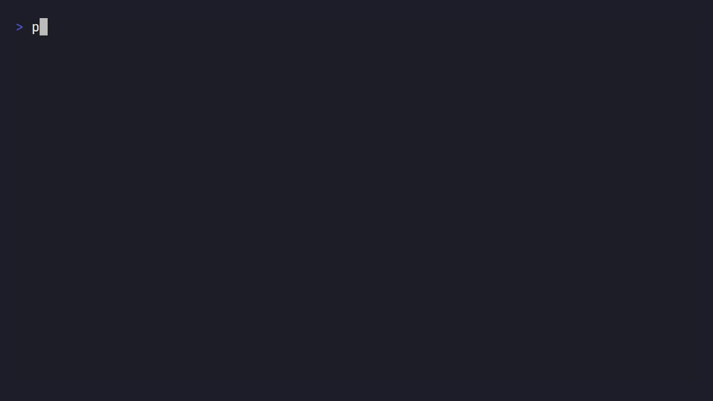

<div align="center">

# ProofRun

**给 AI 编程 Agent 用的本地验证凭证。**

[](LICENSE)
[](go.mod)
[](https://github.com/yebiguo/proofrun/actions/workflows/test.yml)
[](https://codecov.io/gh/yebiguo/proofrun)
[](https://github.com/yebiguo/proofrun/releases)

[English](README.md) · [简体中文](README.zh-CN.md)

</div>

---



ProofRun 不判断你的代码写得对不对。它只证明——用密码学指纹，而不是靠信任——哪些检查真的在你现在这份确切的代码上跑过。

## 问题在哪

AI 编程 Agent 说"所有测试都通过了"。这句话是真的吗？

也许是。它上一次真的跑测试的时候，这句话确实是真的。但那可能是三次修改之前的事了。Agent 甚至未必记得自己有没有真的跑过——它可能只是在推断"这个改动看起来没问题，测试应该还能过"。光看这句话本身，你没法分辨"我跑了，而且真的过了"和"我觉得应该会过"之间的区别。

ProofRun 补的就是这个缺口。不是靠让 Agent 更诚实，而是让这句话本身变得可以被核查。

## 怎么用

```bash
$ proofrun run test -- pytest
...
test: pass (exit 0, 1841ms)

$ proofrun status
test                 PASS    (exit 0, 1841ms)

# 这之后代码被改了——不管改的人是 Agent 还是人类

$ proofrun status
test                 STALE   (last run: pass, exit 0 — code changed since)
```

每一条检查结果都绑定着你当前代码状态的指纹：git commit，加上所有未提交改动（不管有没有 stage、有没有被 git 跟踪）算出的哈希。哪怕只改了一个字节，结果都会自动变成 `STALE`。不需要谁记得去问"这个 PASS 现在还作数吗"。

## 安装

```bash
curl -L https://github.com/yebiguo/proofrun/releases/download/v0.3.0/proofrun_linux_amd64.tar.gz | tar xz
# 其他平台见 https://github.com/yebiguo/proofrun/releases
```

或者从源码构建：

```bash
go install github.com/yebiguo/proofrun/cmd/proofrun@latest
```

## 快速上手

```bash
proofrun init                      # 生成 .proofrun.yml
proofrun run test -- pytest        # 真实执行 pytest，把结果绑定到当前代码
proofrun status --strict           # 只要有检查不是 PASS 就非零退出
```

## 为什么不能只靠信任 Agent

- **全程零 LLM 调用。** ProofRun 不用 AI 去验证 AI。它就是启动一个真实子进程，读它真实的退出码——机制就这么简单。
- **只有四种状态，没有一种是猜的。** `PASS`、`FAIL`、`STALE`、`NOT RUN`——每一个都来自一次被观察到的真实执行，或者"确实没执行过"这个事实本身。没有第五种"大概率没问题"。
- **完全离线。** 零网络请求、零遥测、零账号。
- **比对的是参数数组，不是拼接字符串。** 配置里声明的 `pytest -k "foo bar"`，不会被一条拼接后长得像、但实际参数边界不同的命令蒙混过去——ProofRun 比对的是真实的参数数组，不是拼出来的文本。

## ProofRun 刻意不做的事

不解析测试输出，不判断代码质量，也不自动修复任何东西。完整边界见 [AGENTS.md](AGENTS.md)。

## 由两个 AI agent 一起写出来，谁都不是单方面说了算

ProofRun 的代码由 AI 编程 agent（Claude Code）在人类主导下写出来。**不只是第一个版本**——每一次改动都要经过第二个 AI agent（Codex）独立的、只读的对抗性审核才能合并；人类主导整个过程、做最终的合并决定，但不会单凭任何一个 agent 自己说"这个没问题"就采信。

这套审核流程不是走个形式。发布第一个版本前，那轮审核就发现 ProofRun 自己的命令比对逻辑能被骗过：一个被 shell 引号意外吞并的参数，能让一条检查悄悄跑了零个测试，还照样报 `PASS`。完整复现过程、具体修法、为什么简单打个补丁不够 → [docs/case-study.md](docs/case-study.md)（英文）。项目往后发展，这套流程照样在抓真实的、severity-critical 级别的漏洞——最近一次是在 v0.3，审核抓到一个被符号链接的 `.proofrun` 目录，能让攻击者预置的签名密钥被悄悄当成可信密钥采纳，代码还没发布出去就被拦了下来。

每一处修复在被接受之前，都用真实复现验证过，不是"看起来合理就通过"，也不只是发布前查一次。一个存在的目的就是让 AI agent 对自己的话负责的工具，如果连同样的审视用在自己身上都扛不住——而且是持续地扛，不是只在发布那一刻扛一次——那它就没有存在的必要。

## 命令

```bash
proofrun init                      # 生成 .proofrun.yml
proofrun run <check-name> -- <cmd> # 真实执行 <cmd>，把退出码+耗时绑定到当前 git 状态
proofrun run-all [--only <name>]   # 跑完所有声明的检查，每跑完一条就落盘一次
proofrun status [--strict]         # 每条检查的 PASS / FAIL / STALE / NOT RUN；--strict 下只要有 required 检查不是 PASS 就非零退出
proofrun report [--json]           # 完整报告，人类可读或 JSON
```

## 配置：`.proofrun.yml`

```yaml
checks:
  test:
    command: [pytest]
    required: true
  build:
    command: [npm, run, build]
    required: true
  lint:
    command: [ruff, check, .]
    required: false
```

`command` 是参数数组，不是 shell 字符串——ProofRun 从不经过 shell，比对"实际跑的"和"配置声明的"必须逐个参数精确匹配。`required: true` 是让一条检查能挡住 `status --strict` 的开关，这正是接入 pre-commit hook 或 CI 门禁时要用的字段。

## 指纹是怎么算的

每条结果都绑定着当前 git `HEAD`，加上 `git diff HEAD` 与所有未跟踪、未被 gitignore 的文件内容一起算出的 SHA-256 哈希。`proofrun status` 每次都会重新算一遍这个指纹，跟本地存的对比——哪怕只是改了一个空格、或者多了一个新文件，都会被判定为 `STALE`。

## 篡改可检测的 receipt

每一条存下来的结果都会被签名(HMAC-SHA256),密钥是第一次用的时候自动随机生成的,存在 `.proofrun/secret` 里——自动创建,会尽力通过仓库本地的 `.git/info/exclude` 避免被普通 `git add .` 收录(即便你自己的 `.gitignore` 从没提到过 `.proofrun/`;万一这个密钥最终还是被 git 跟踪了,ProofRun 会拒绝信任它,而不是拿一个"任何 clone 过这个仓库的人都已经知道"的密钥继续签名)。ProofRun 自己不会把这个密钥发送到任何地方。手改过的 `receipt.json`——哪怕指纹对得完全一样——现在也验证不过。对于 `.proofrun.yml` 里声明过的检查,这会显示成 `NOT RUN`;对于那种从没在 `.proofrun.yml` 里声明过、只是临时 `proofrun run` 过一次的检查,验证不过的记录会被直接丢弃,这条检查会从 `status` 输出里彻底消失——不会显示成假的 PASS,只是不会被计入而已。

**这个机制保证了什么、没保证什么:**
- **是"能发现篡改",不是"篡改不了"。** 能拦住的是随手改一下文件(或者一个不知道签名机制存在的 AI agent 试图伪造结果那种)——拦不住一个已经能读到 `.proofrun/secret` 的老练攻击者,他完全可以伪造出一个能通过验证的签名。这是任何"只在本机验证"的机制天生的局限,不是这里特有的缺陷。
- **只在本机有效,不是能拿去给别人看的证据。** 把 `receipt.json` 复制到另一台机器、但没带上 `.proofrun/secret`,就验证不过。这个机制从来就不是设计成"拿给别人看、让别人信"的——真正能让第三方信任的,是 GitHub Action 那次独立重跑。
- **不防重放/回滚。** 一份真实签过的旧 receipt,如果后来又在一份指纹完全相同的工作区下被恢复出来(比如代码被还原成了之前的状态),照样能验证通过——签名证明的是"这台机器确实在某个时刻产生过这个结果",不是"这是最新一次运行的结果"。
- **v0.3 之前生成的旧 receipt 没有迁移方案**——直接读作 `NOT RUN`,重新跑一遍就好。
- **GitHub Action 完全不依赖这套机制**——它从来就不信任 PR 分支带过来的 `receipt.json`(重新跑之前会先清空 `.proofrun/`),所以本地签名这件事跟 Action 输出结果的可信度没有关系。

## `receipt.json`

`.proofrun/receipt.json` 是一份普通的、可以直接读的 JSON 文件,外部工具确实可以直接解析它——但**磁盘上这份原始文件是没有经过信任过滤的存储,不是一份已经验证过的可信视图**。自己读这份文件,就意味着你得自己做签名验证(不然就是只信指纹和退出码,而这正是这整个项目存在的意义所在——要堵住的那种假 PASS 风险)。如果你要的是 ProofRun 真正的信任判断结果(验过签名、无效条目已经被剔除),应该调用 `proofrun status`/`proofrun report --json`,或者自己照着下面说的 `Receipt.Load` 的逻辑重新实现一遍,而不是直接把文件内容当真。下面这份是真实跑出来的,对这个仓库执行 `proofrun run build -- go build ./...` 之后原样产生的:

```json
{
  "schema": "proofrun/v2",
  "checks": {
    "build": {
      "status": "pass",
      "command": ["go", "build", "./..."],
      "exit_code": 0,
      "duration_ms": 1543,
      "started_at": "2026-08-16T12:32:23.2985133Z",
      "verified_against": {
        "head": "13ee2ba83dd2d0b992101a1e7462397758704663",
        "diff_sha256": "e3b0c44298fc1c149afbf4c8996fb92427ae41e4649b934ca495991b7852b855"
      },
      "signature": "02d78d28bf62cad8226b48ce93fc6e21a29d3d4037b7bebed0b0a6628ede2a2f"
    }
  }
}
```

| 字段 | 含义 |
|---|---|
| `schema` | 格式标记(v0.3 起是 `proofrun/v2`)。这只是给人看的标签,不参与验证逻辑——签名是否有效才是真正的判断依据,不是这个字符串。 |
| `checks.<name>.status` | 上一次真实执行的字面结果:`"pass"` 或 `"fail"`,只由进程的退出码决定。`STALE` 和 `NOT RUN` 从来不会写进这个文件——它们是读取的时候现算的,不是存出来的。 |
| `checks.<name>.command` | 真正执行的完整参数数组——从来不是拼接出来的 shell 字符串。 |
| `checks.<name>.exit_code`、`duration_ms`、`started_at` | 字面意思。 |
| `checks.<name>.verified_against` | 这条结果绑定的 git `head` 提交和 `diff_sha256` 指纹——`status` 命令就是拿这个跟当前指纹对比,来判断到底是 `PASS`/`FAIL` 还是 `STALE`。 |
| `checks.<name>.signature` | 用本机的本地密钥(见上面"篡改可检测的 receipt"一节),对这条记录里除 `signature` 自己以外的所有字段算出的 HMAC-SHA256。 |

**"磁盘上的内容"和"可信视图"是两码事——如果你要自己解析这份文件,这是最关键的一点:** 一条检查如果签名验证不过,**既不会**被改写成 `"status": "tampered"` 这种值,**也不会从文件里被删掉**——ProofRun 除了真的执行一次 `run`/`run-all`,不会在任何其他情况下往 `receipt.json` 里写东西。一条手改过的记录会原样留在磁盘上,`"status": "pass"` 什么的都还在,一直留到有人重新跑一遍那条检查为止。真实发生的事情范围更窄:`Receipt.Load`(`status`/`report` 内部调用的就是这个函数)会解析文件、检查每条记录的签名,把验证不过的条目从**它返回的内存结果里**剔除——那条检查读出来就是 `NOT RUN`(如果这条检查根本没在 `.proofrun.yml` 里声明过,甚至会从 `status` 输出里彻底消失,见上文)。这个过滤动作从来不会碰磁盘上的文件本身。

具体来说:如果你自己 `json.parse` 这份原始文件,直接相信 `checks.test.status == "pass"`,你面对的正是这个项目从一开始就要堵住的那种假 PASS 风险——签名校验才是让这个状态值得信任的那一步,跳过它不是抄近路,是彻底绕开了整套机制。如果你想自己实现签名校验、不想每次都调用 `proofrun`:做法是对某条检查对象的 JSON 编码算 HMAC-SHA256,编码前先把 `signature` 字段本身置空(`""`),密钥用的是本机 `.proofrun/secret` 里的内容——想照着实现的话,具体签的是哪些字节,看 `internal/receipt/sign.go` 里的实现。

## GitHub Action

```yaml
on: pull_request
permissions:
  contents: read
jobs:
  verify:
    runs-on: ubuntu-latest
    steps:
      - uses: yebiguo/proofrun@v1
```

这个 Action 会自己独立完成一次 checkout，精确到 PR 的 head commit——它从不信任调用它的 workflow 已经 checkout 出来的内容，所以就算触发方式是 `pull_request`，也不会被 GitHub 默认给的那个合并预览 commit 悄悄替换掉。接着它会清空 PR 分支上带过来的任何 `receipt.json`，下载一个经过校验和验证的 `proofrun` 二进制，真实跑一遍 `proofrun run-all`，最后用 `proofrun status --strict` 做门禁。PR 分支里带的 receipt 从头到尾都不会被信任——门禁看到的每一条结果，都是这次运行自己产生的。

**已知局限：** 这个 Action 保护不了 `.proofrun.yml` 本身——如果同一个 PR 一边改代码一边把某条检查的命令改弱了，Action 只会老老实实地把这条变弱后的检查重新跑一遍。它会在 `.proofrun.yml` 相对 PR 的 base 分支有变化时发一条警告（构建标注），但不会拿这个去挡 PR；这个 diff 需要你像审查其它改动一样自己看一眼。

## 路线图

- **v0.4** —— 支持解析 pytest、Jest、JUnit 等常见测试框架的结构化输出
- 让同一个 PR 没法悄悄改弱 `.proofrun.yml` 本身（目前只警告不拦截，见上面的"已知局限"）
- 比本地篡改检测更强的机制（远程证明、公钥签名）还没有设计方案——见上面"篡改可检测的 receipt"一节，了解 v0.3 具体保证了什么、刻意没有保证什么

## 参与贡献

欢迎 Issue 和 PR。这还是一个年轻的、1.0 之前的项目，范围收得很窄，而且是刻意收窄的——在提议任何涉及 STALE 判定逻辑或 receipt schema 的改动之前，先看一眼 [AGENTS.md](AGENTS.md)：这两块是这个项目最经不起出错的地方。

## 许可证

MIT
